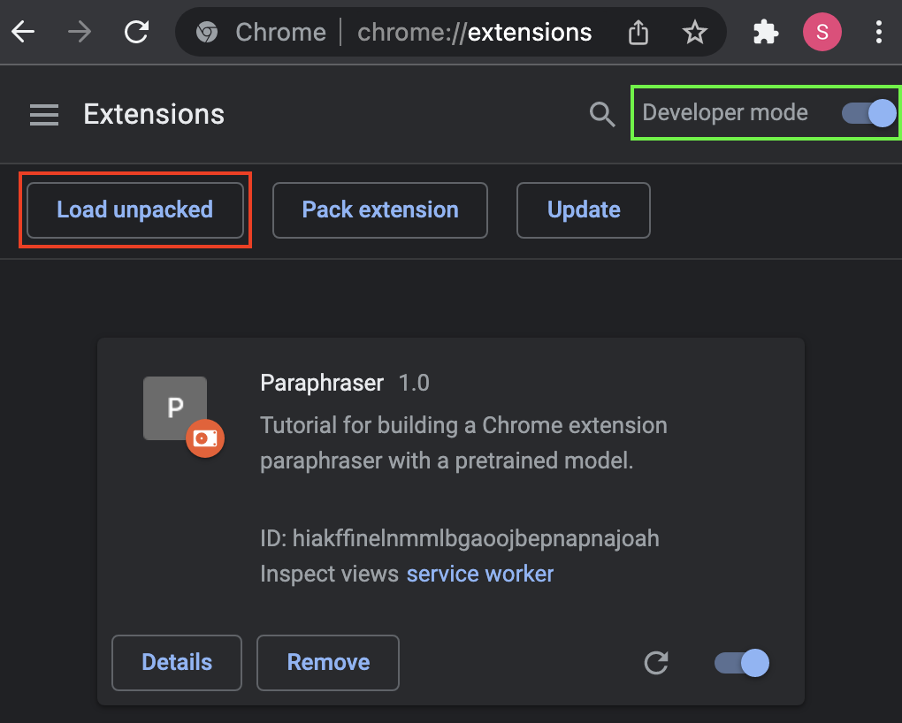

# Tutorial for making a Chrome browser extension paraphraser tool

# Adding the extension to Chrome

1. Clone or download this repo to the computer where you're running Chrome.
2. Set your API key in the first line in popup.js: `const apiKey = "Your API key on pretrained.convect.ml";` **Note: do not publish this key** (e.g. do not commit it to GitHub or publish this extension with the key visible in plain text). There are ways to hide the key securely that are beyond the scope of this tutorial.
2. Open the Extension Management page in Chrome by navigating to `chrome://extensions`.
3. Enable Developer Mode by clicking the toggle switch next to **Developer mode**.
4. Click the **Load unpacked** button and select directory you downloaded from this repo.

